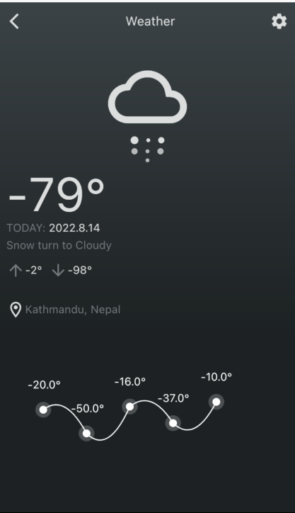

# flutter_animation_challenges

A projects showing different pages with animation within it.

A few resources to get you started if this is your first Flutter project:

- [Lab: Write your first Flutter app](https://docs.flutter.dev/get-started/codelab)
- [Cookbook: Useful Flutter samples](https://docs.flutter.dev/cookbook)

For help getting started with Flutter development, view the
[online documentation](https://docs.flutter.dev/), which offers tutorials,
samples, guidance on mobile development, and a full API reference.

## Animated pages
- [Weather by BeardChicken on Dribbble](https://dribbble.com/shots/1362152-Weather)

   
  